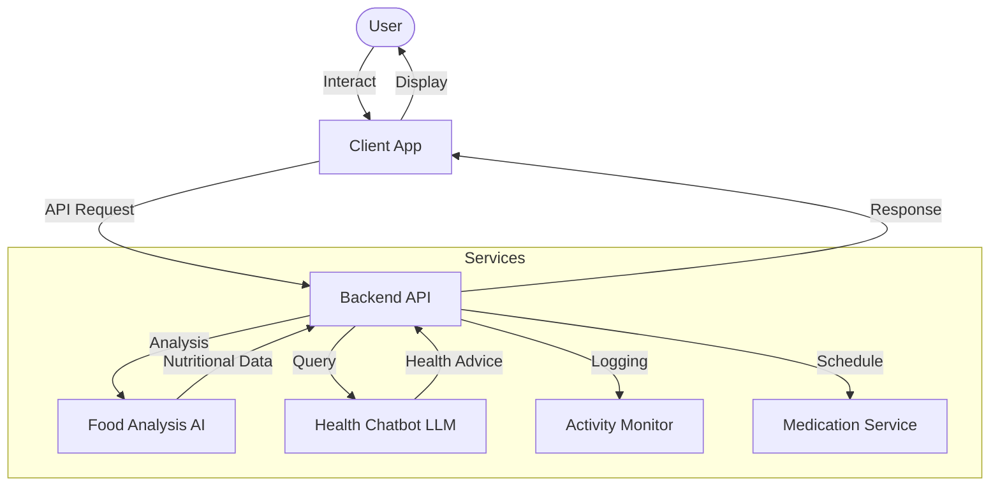

 recovr.ai: Your Personal Health Companion

we have deployed : https://recovr-ai.onrender.com
 


## 📖 Project Overview

  is a holistic health management system designed to empower users with AI-driven insights into their daily well-being. From tracking nutrition to managing medication schedules, the application serves as a dedicated personal health assistant.

### Architecture
The application utilizes a Client-Server architecture. The frontend (Mobile/Web) communicates with a centralized Backend API, which orchestrates data flow between the database and specialized AI services for Natural Language Processing and Computer Vision.

#### System Flowchart


## 🚀 Key Features

### 1. AI Chatbot Assistant
An intelligent conversational interface allowing users to ask health-related questions.
*   **Symptom Checker:** Preliminary triage based on user inputs.
*   **Health Tips:** Personalized wellness advice.

### 2. Food Analysis
Leverages Computer Vision to analyze food images.
*   **Snap & Track:** Upload meal photos for instant recognition.
*   **Nutritional Breakdown:** Estimates calories, proteins, fats, and carbs.

### 3. Medication Reminder
Ensures adherence to medical prescriptions.
*   **Smart Scheduling:** Reminders based on time or meal context.
*   **Inventory Tracking:** Alerts when refills are needed.

### 4. Daily Activity Monitoring
Tracks physical movement to promote an active lifestyle.
*   **Step Counting:** Integration with device sensors.
*   **Activity Logs:** Historical view of daily exercise and calories burned.

## 🛠️ Setup and Install

### Prerequisites
*   Node.js v16+ or Python 3.9+ (depending on backend choice)
*   Docker (optional)
*   API Keys for AI Services (e.g., OpenAI, Gemini)

### Installation

1.  **Clone the Repository**
    ```bash
    git clone  
    
    ```

2.  **Install Dependencies**
    *For Python Backend:*
    ```bash
    pip install -r requirements.txt
    uvicorn main:app --host 0.0.0.0 --port $PORT
    ```
    *For Node.js*
    ```bash
    npm install
    node app.js
    ```
 
